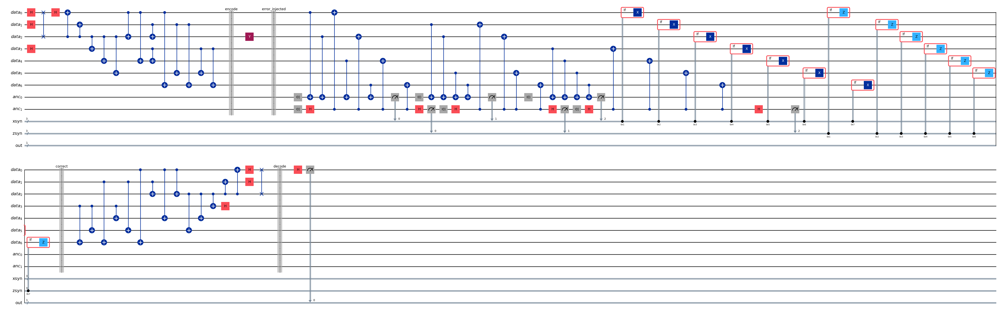

# Steane [[7,1,3]] Quantum Error Correction Demo

This repo contains a small educational simulator for Steane's 7-qubit quantum error-correcting code. It shows how one logical qubit can be encoded into 7 physical qubits, how a single-qubit Pauli or random unitary error is detected with syndrome measurements, and how classical feedforward applies the correction before decoding the state.

The project has two main ways to use it:

- `steane_qec.ipynb`: a standalone notebook demo for quick presentation or walkthrough.
- `steane_demo.py` + `steane_gui.py`: a reusable Python simulator and GUI for interactive testing.



## What This Demonstrates

The Steane code is a CSS code based on the classical Hamming-code structure. It can correct any single-qubit error on the 7 data qubits. In this project, the code handles:

- `X` errors, also called bit flips
- `Z` errors, also called phase flips
- `Y` errors, which behave like both an `X` and a `Z` error up to a global phase
- arbitrary single-qubit random unitary errors, which syndrome measurement breaks into Pauli-like branches

For example, if the logical input is `|+>` and a `Y` error is applied to one physical qubit, both the X-error and Z-error syndromes should appear. After correction and decoding, the state should still be `|+>`. The demo applies a final Hadamard before measurement for `|+>`, so a successful recovery gives:

```text
P(|0>) = 1
P(|1>) = 0
```

## File Guide

### `steane_qec.ipynb`

This is the notebook version. It is meant to be readable and presentable by itself. It includes:

- install/import cells
- Steane-code parameters
- encoder and decoder construction
- syndrome extraction
- correction rules using mid-circuit measurements and classical feedforward
- demo cases for no error, `X`, `Z`, `Y`, and random unitary noise

Use this when you want to walk through the idea step by step in class, Colab, or Jupyter.

### `steane_demo.py`

This is the main simulator used by both the command line and GUI. It exposes:

```python
run_case(initial, error_type, target_qubit, apply_random_unitary=False, verbose=True)
```

It returns a dictionary containing:

- the generated `QuantumCircuit`
- raw Qiskit counts
- final decoded `data[0]` probabilities
- the most frequent X and Z syndrome values
- the full syndrome distribution for random unitary cases
- a boolean `correct` flag

Use this file when you want repeatable programmatic control or want to connect the simulator to another interface.

### `steane_gui.py`

This launches the GUI. The GUI lets you pick:

- initial logical state: `0`, `1`, or `+`
- Pauli error: `None`, `X`, `Y`, or `Z`
- target data qubit: `0` through `6`
- continuous random unitary error instead of a Pauli error

When random unitary mode is checked, the Pauli selector is disabled because the Pauli error is ignored. The result box shows all measured syndrome branches, since a random unitary generally produces a probability distribution over Pauli-like correction branches.

## Setup

Create and activate a virtual environment if you want one, then install requirements:

```bash
pip install -r requirements.txt
```

The project uses Qiskit and Qiskit Aer. The GUI also uses CustomTkinter and Pillow, which are already used by the included GUI file.

## Running The Notebook

Open:

```text
steane_qec.ipynb
```

Then run the notebook cells from top to bottom. The demo cells near the bottom show:

- Demo 0: no error
- Demo 1: X error
- Demo 2: Z error
- Demo 3: Y error on `|+>`
- Demo 4: random unitary noise

## Running The Command-Line Demo

Run all built-in demo cases:

```bash
python steane_demo.py --demo
```

Run one case:

```bash
python steane_demo.py --initial + --error Y --qubit 2
```

Run a random unitary case:

```bash
python steane_demo.py --initial 1 --error None --qubit 1 --random-u
```

The qubit index must be from `0` to `6`.

## Running The GUI

Launch:

```bash
python steane_gui.py
```

Choose your inputs on the left, then click `Run Simulation`. The GUI will:

- run the Qiskit Aer simulation
- display syndrome results and final probabilities
- draw the generated circuit
- save the circuit diagram as `gui_circuit.png`

Use `Save Circuit Image As...` to export the circuit image somewhere else.

## Random Unitary Notes

A random unitary is not just one clean `X`, `Y`, or `Z` error. It can be written as a combination of Pauli components. When syndrome measurement happens, the circuit lands in one of those syndrome branches. This is why the GUI and CLI show a syndrome branch distribution in random-unitary mode.

So if one run mostly shows Z-like branches, that does not mean the code is broken. It means that particular random unitary had larger phase-error components. Running the GUI again generates a new random unitary, so the branch distribution can change.

## Expected Correctness

For a single-qubit Pauli error, the syndrome should identify the target qubit exactly:

- `X` error: X-error syndrome lights up
- `Z` error: Z-error syndrome lights up
- `Y` error: both syndromes light up

For `|+>` demos, the final Hadamard maps the recovered `|+>` to `|0>`, so the pass condition is `P(|0>) = 1`.

## Repository

GitHub repo:

```text
https://github.com/adhyanthac/steane-qec.git
```

